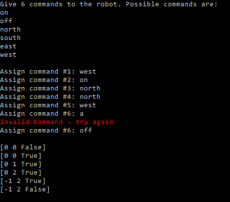

# Assignment 4 – IRobot

## Value (%)

This assignment is worth 10% of your course grade.

## Task

You will implement the Command design pattern using interfaces in C#. You will be given a `Robot` class and a set of command classes that inherit from an abstract class. Your task is to:

1. Replace the abstract class with an interface.
2. Recreate the existing command classes to implement the new interface.
3. Update the `Robot` class to use the new interface.
4. Design and implement a new command class.
5. Write unit tests for the `Robot` class and command classes.
6. Create a `RobotTester` class that allows user input to load and execute robot commands.

## How to Complete This Assessment

Follow these steps to complete the assignment:

1. Create an `IRobotCommand` interface in the InterfaceCommand.cs file and define the `Run` method signature in it. This will replace the `RobotCommand` abstract class.
2. Recreate the existing command classes (`OffCommand`, `OnCommand`, `WestCommand`, `EastCommand`, `SouthCommand`, and `NorthCommand`) to implement the `IRobotCommand` interface instead of inheriting from the `RobotCommand` abstract class. Update their `Run` method implementations as necessary.
3. Update the `Robot` class to use the `IRobotCommand` interface in place of the `RobotCommand` abstract class. Update the `_commands` array and the `LoadCommand` method accordingly.
4. **Complete the XML documentation within the `Robot` class**.
5. Design and implement a new command class that implements the `IRobotCommand` interface. This new command should perform a unique action on the robot.
6. Write unit tests to cover the `Robot` class and the command classes, ensuring that the implemented commands work correctly and the robot behaves as expected.
7. Create a new `RobotTester` class that allows the user to input strings via the console to load robot commands. This tester class should:
    - Prompt the user to enter command strings
    - Convert the input strings into command objects
    - Load the commands into a robot instance
    - Run the robot, displaying the robot's state after each command execution
8. Test your implementation using the `RobotTester` class to ensure everything works as expected.

## How to Submit Your Assessment

Submit a link to the GitHub repo containing your code and embed an image into your GitHub README that shows the output of your `RobotTester` class. An example image is below.

## Grading Rubric

### Results (70%)

| Points | Description                                                                                   |
|:------:|-----------------------------------------------------------------------------------------------|
|   7    | Excellent: Thorough test coverage including edge cases; all tests pass.                      |
|   6    | Good: Comprehensive test coverage with some edge cases; majority of tests pass.              |
|   5    | Satisfactory: Adequate test coverage; more than half of tests pass.                          |
|   3    | Needs Improvement: Limited test coverage; less than half of tests pass.                      |
|   1    | Poor: No tests or minimal tests; none of the tests pass.                                     |
|   0    | Code does not build in the CI workflow.                                                       |

### Class/Method/Variable Naming (10%)

| Points | Description                                                                                   |
|:------:|-----------------------------------------------------------------------------------------------|
|   1    | Excellent: Consistent, meaningful, and clear naming conventions for all classes, methods, and variables. |
|  0.75  | Good: Mostly consistent and meaningful naming conventions; minor inconsistencies or unclear names. |
|  0.5   | Needs Improvement: Inconsistent naming conventions; some unclear or confusing names.          |
|   0    | Poor: No clear naming conventions; many unclear or confusing names.                           |

### Comments/Documentation (10%)

| Points | Description                                                                                   |
|:------:|-----------------------------------------------------------------------------------------------|
|   1    | Excellent: Comprehensive comments and documentation; easy to understand the purpose and functionality of code. |
|  0.5   | Needs Improvement: Some comments and documentation, but lacking clarity or detail in certain areas. |
|   0    | Poor: No comments or documentation; difficult to understand the purpose and functionality of the code. |

### Formatting (10%)

| Points | Description                                                                                   |
|:------:|-----------------------------------------------------------------------------------------------|
|   1    | No formatting is required during the formatting workflow.                                     |
|  0.25  | Minimal formatting is required during the formatting workflow.                                |
|   0    | Extensive formatting is required during the formatting workflow.                              |
